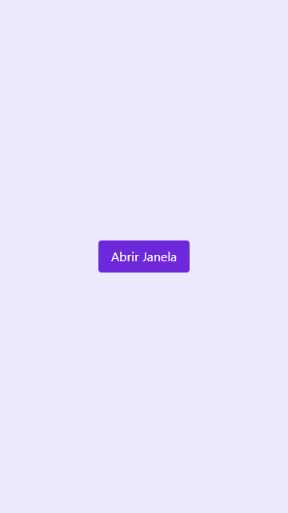
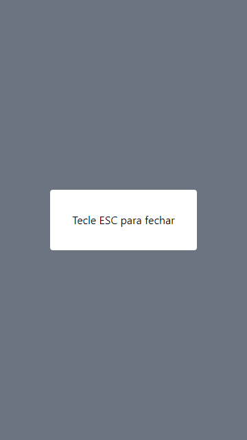

# modal-tailwind
Modal wrapper using Tailwind and Event Listeners.

- Clicking the button removes the `invisible` class from the modal wrapper.
- Pressing the ESC key with the modal visible adds the `invisible` class again.

  
  

